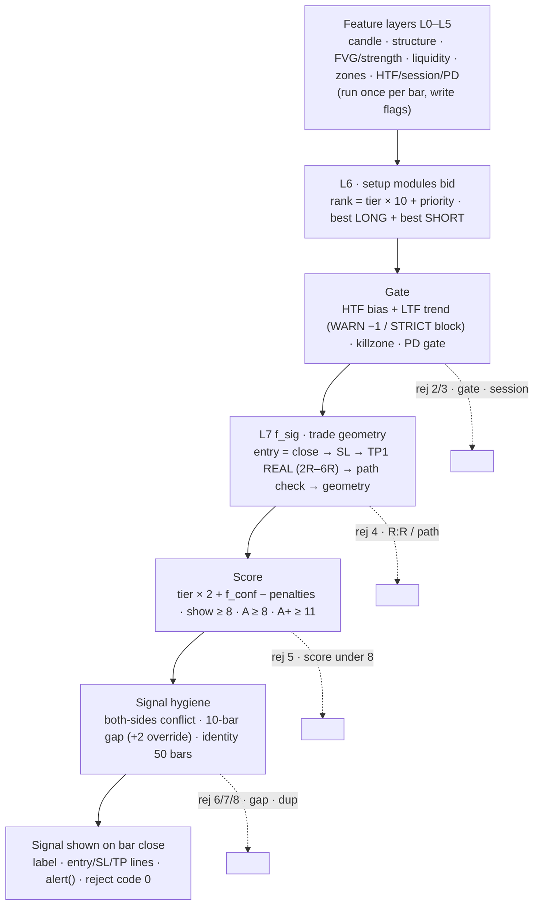
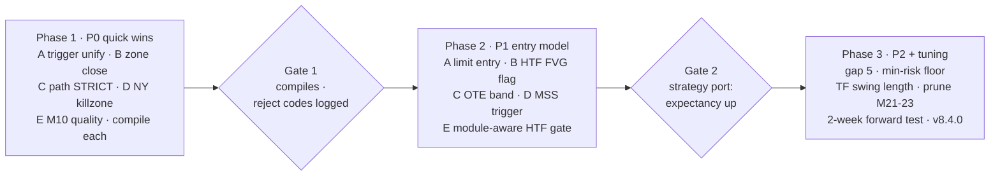

# SMC ইন্ডিকেটর রিভিউ ও এন্ট্রি উন্নয়ন প্রস্তাব

তারিখ: 2026-10-03 · ফাইল: `SMC_Pattern/SMC.txt` (SMC / ICT Suite v8.3.2, Pine v6, 3,925 লাইন) · অনলাইন কপি: https://claude.ai/code/artifact/2130e479-f41b-45c9-9f1f-708f4798ddd9

---

## ১. সারসংক্ষেপ

SMC / ICT Suite v8.3.2 architecture-এর দিক থেকে পরিণত, কিন্তু entry এখনো সবচেয়ে আক্রমণাত্মক ধাপে ঢোকে: POI-তে প্রথম reversal candle-এর close-এ। false entry-র মূল উৎস সেখানেই, zone বা structure detection-এ নয়।

### যা ভালো আছে

- 8-layer feature-vector (L0 candle → L7 trade): প্রতিটি engine বারে একবার চলে, setup গুলো শুধু flag পড়ে। logic পরিষ্কার, ভুল খুঁজে বের করা সহজ।
- Structure: BOS-এ displacement বাধ্যতামূলক, CHoCH protected swing + LH/HL নিয়মে, counter-trend break "internal" হিসেবে আলাদা, weak break-এ follow-through লাগে।
- Liquidity: pivot BSL/SSL, EQH/EQL pool, PDH/PDL, PWH/PWL, Asia SESH/SESL; শুধু qualified level-এর sweep setup chain arm করে।
- Zone: ICT-সঠিক OB (displacement-এর আগের শেষ opposite candle + FVG alignment), Breaker, Reclaimed, Rejection, QM, Key Level score, 50% rule, touch ≥2 → sweep required, Propulsion block।
- Trade engine: SL zone/sweep/major অগ্রাধিকারে, TP1 শুধু REAL opposite level (zone/FVG/qualified liquidity) min 2R–max 6R band-এ, geometry gate, duplicate-identity suppression, reject code diagnostics।
- Repaint নিরাপত্তা: FVG ও সব drawing `barstate.isconfirmed`-গেটেড, HTF data `lookahead_on` + `[1]` offset।

### যেখানে accuracy হারাচ্ছে

1. Default "Zone entry trigger" = IMMEDIATE। CONFIRMED mode আছে, কিন্তু সেটিও micro-level (reaction candle-এর high close হলেই), প্রকৃত LTF structure shift নয়।
2. CONFIRMED mode চালু করলেও M08, M09, M36 (তিনটিই default ON) তা মানে না। ওরা সরাসরি `cd.pinBull` পড়ে, `trigBull` নয়।
3. Entry price = confirming candle-এর close। displacement candle হলে entry POI থেকে অনেক দূরে, SL zone-এর নিচে → risk বড়, R:R নষ্ট, বা signal R:R gate-এ বাদ।
4. HTF-এ শুধু structure bias আছে, HTF POI (OB/FVG) নেই।
5. TP1 path check default WARN: entry আর TP1-এর মাঝে qualified opposing zone থাকলেও signal দেখায় (শুধু −1 point)।
6. Session window UTC-তে fixed। DST-তে London/NY killzone এক ঘণ্টা সরে যায়। Killzone filter default OFF।
7. Zone touch-এর সংজ্ঞা: low zone top ছুঁলেই এবং close zone bottom-এর উপরে থাকলেই। reversal candle zone-এর ভেতরে close করলেও entry হয়।
8. M36 শুধু `ft.sweptLow` দিয়েই fire করে, কোনো reversal candle ছাড়া।

**প্রস্তাবের সার**: ৫টি P0 পরিবর্তন (token cost প্রায় শূন্য), ৪–৫টি P1 (entry refinement, HTF FVG flag, OTE band, MSS trigger, module-aware gate), বাকি P2। Build 100,256 compiled-token সীমার কাছে, `Ctx` type 254-element cap-এ, main scope local-variable limit-এ। তাই প্রতিটি পরিবর্তন function-এর ভেতরে, `Feat`/`Sx`-এ field যোগ করে, প্রতি ধাপে compile check করে।

---

## ২. ব্যবহৃত ফিচারসমূহ

| স্তর | ফিচার | কীভাবে কাজ করে | Default / input |
| --- | --- | --- | --- |
| General | Pine v6 overlay | max 500 label · 500 line · 500 box · max_bars_back 500 · request.security 3টি | ATR 14 · swing length 5 |
| L0 Candle | Pin bar | wick ≥ 2 × body এবং wick/range ≥ 0.55, উল্টো wick ≤ body | 2.0 · 0.55 |
| L0 Candle | Doji · Engulfing · Inside bar · Harami | body ≤ 10% range · পুরো আগের body ঢেকে উল্টো রঙ · আগের range-এর ভেতরে · body < 60% আগের body | 0.10 · 0.60 |
| L0 Candle | Long-wick rejection · Shooting star | wick ≥ 50% এবং range ≥ 1.5 ATR · pin bar যার high ref-high-এর 1 ATR-এর মধ্যে | 0.50 · 1.5 · 1.0 |
| L0 Candle | IFC candle | ref extreme পার করে wick ≥ 2 × body, নিজের রঙে close | 2.0, any-colour OFF |
| L0 Candle | Manipulative candle | আগের low sweep করে আগের high-এর উপরে close (wick ≥ 30%) | 0.30 |
| L1 Structure | Swing pivot + HH/LH/HL/LL tag | `ta.pivothigh/low(5,5)`; শেষ pivot-এর ধরন `sx.hiType` / `sx.loType` | 5 |
| L1 Structure | BOS (displaced) | trend দিকে last pivot পার করে close + displacement (body/range ≥ 0.5 এবং range ≥ 0.6 ATR, অথবা level-এর ≥ 0.3 ATR উপরে close) | Candle gate ON |
| L1 Structure | CHoCH | trend-এর বিপরীতে protected swing (leg origin) পার করে close, অথবা LH + last pivot low পার (R2); displacement লাগে | — |
| L1 Structure | Internal BOS · Weak BOS | counter-trend pivot break = internal (label only) · displacement ছাড়া break = weak, 3 bar-এ follow-through হলে promote | pendBars 3 |
| L1 Structure | RANGE | পরপর 2টি break level-এর ভেতরে ফিরে এলে, অথবা 20 bar event ছাড়া | 2 · 20 |
| L1 Structure | Leg origin · PB✓ · movePhase | `f_legOrigin` = break করা leg-এর price extreme · valid pullback one-shot · IMPULSIVE / RETRACEMENT / RANGE | — |
| L1 Structure | CISD | leg extreme বানানো candle series-এর প্রথম open পার করে close; শুধু qualified sweep-এর 30 bar-এর মধ্যে | sweep gate ON |
| L2 FVG | Fair Value Gap | 3-candle gap ≥ 0.1 ATR, শুধু confirmed bar-এ; mitigation TOUCH / 50% / FULL; 40টি tracked | 0.10 · TOUCH · 40 |
| L2 Strength | Move strength (STRONG) | leg-এ FVG ≥ 1, body efficiency ≥ 0.55, flip ≤ 0.35, speed ≥ 0.35 ATR/bar; শুধু BOS / CHoCH / zone tap-এ মাপা | 1 · 0.55 · 0.35 · 0.35 |
| L3 Liquidity | BSL / SSL · EQH / EQL pool | প্রতিটি pivot-এ level; 0.10 ATR-এর মধ্যে দ্বিতীয় pivot এলে pool | 0.10 |
| L3 Liquidity | PDH/PDL · PWH/PWL · SESH/SESL | security D ও W এর high[1]/low[1]; Asia range শেষে SESH/SESL | সব ON |
| L3 Liquidity | SWEEP বনাম RUN | wick পার করে close ফিরে এলে SWEEP; body ≥ 0.6 এবং ≥ 0.25 ATR beyond close হলে RUN; নইলে 2-bar failed-close window | 0.60 · 0.25 · 2 |
| L3 Liquidity | Qualified sweep (S5) | pool / PD / PW / SES sweep-ই HP-OB, M41, M45, M54, CISD, f_conf arm করে; pivot sweep internal (M49 / M53) | Major only |
| L3 Liquidity | Touch · eviction · targets | 0.15 ATR tolerance, 3-bar cooldown · priority eviction · 3 ATR-এর মধ্যে bslAbove / sslBelow | 30 level |
| L4 Zones | SR wick zone + Key Level score | প্রতিটি pivot-এ wick zone; BOS-এ origin zone score = 1 + departure FVG + STRONG departure + hidden interest clean (+ volume); KL ≥ 3 tradable, KL★ ≥ 4 | klMin 3 |
| L4 Zones | Order Block | leg-এর প্রথম displacement candle-এর আগের শেষ opposite candle (T1 / T1b / T2 / G2); 3 bar-এ aligned FVG লাগে; T3 self-mitigation invalid; T5 no-FVG | HP-only OFF |
| L4 Zones | HP OB · Breaker | OB-এর 10 bar আগে qualified sweep হলে ★ · OB close-এ ভাঙলে উল্টো BRK | sweepWin 10 |
| L4 Zones | RCB · QM · RJB | CHoCH leg origin candle (50% fib gate) · CHoCH-এর 60 bar-এ আগের low-এর নিচে নতুন low · wick ≥ 50% + পরের candle ধরে রাখে, 15 bar-এ BOS ও 2 bar-এ FVG লাগে | fib ON · 60 · 0.50 / 15 |
| L4 Zones | Zone state | flip S→R · IDM level ও IDM✓ · near-miss ★★ · 50% tap · touches ≥ 2 → ⚠SWEEP REQ · PROP | touchCd 3 · prop 10 / 0.8 |
| L4 Zones | Per-side slot (S9) | `ft.zb` / `ft.zs`: priority OB 6 > BRK 5 > RCB/QM 4 > RJB 3 > KL 2 > SR 1, PROP +3; weak / unconfirmed / unscored SR বাদ | 30 zone · age 500 · ≤ 3 ATR |
| L5 HTF | Auto pairing | 1m→15m · 3m→30m · 5m→1h (aggr 30m) · 15m→4h (1h) · 30m→4h · ≤4h→D · D→W; Manual | Conservative |
| L5 HTF | HTF structure bias | একটি security tuple lookahead_on + [1] = repaint নেই; BULL / BEAR / NEUTRAL, displacement body ≥ 50%, protected swing + LH/HL rule | pivot 3 |
| L5 HTF | Sweep · manipulation · rejection | HTF pivot sweep (3 HTF bar valid) · manip candle · wick ≥ 50% rejection | 3 · 0.50 |
| L5 HTF | Bias gate | OFF / WARN (−1, ধূসর label) / STRICT (block); entering-bar trend পড়ে | WARN |
| Session | Killzone + Asia range | Asia 0000–0700 · London 0700–1000 · NY 1200–1500 (timezone input); killzone-only filter · London/NY +1 · Asia SESH/SESL | UTC · filter OFF · score ON |
| PD array | Premium / Discount | dealing range = current leg; discount ≤ 50% / premium ≥ 50%; deep 75% penalty; leg-এর বাইরে = expansion (neutral); hard gate | score ON · gate OFF · 0.75 |
| L6 Setups | ৫০টি module M01–M73 | প্রতিটি একটি boolean, bid = tier × 10 + priority; প্রতি side-এ সেরা একটি | master mode Custom |
| L6 Setups | Default ON | M01 M02 M05 M08 M09 M10 M15 M33 M36 M37 · M39 M40 M41 M42 M45 M46 M51 M54 · M58 M62 M64(draw) M68 M69 M70 M72 M73 | ২৫ ON, ২৫ OFF |
| L6 Setups | Tier | 4 = M37 M41 M42 M54 M68 M73 M45★ · 3 = M09 M33 M36 M39 M46 M51 M45 M10(PD/PW/SES) · 2 = M01 M02 M05 M08 M15 M40 M58 M62 M65 M70 M72 M10(pool) · 1 = বাকি | — |
| L6 Setups | Filters | M19 STRONG arrival-এ reversal বন্ধ · M26 pullback corrective · M31 (OFF) · §6.2 sweep req · §6.6 50% rule · M01/M02 ≥ 2 reject | M31 OFF |
| L6 Setups | Zone entry trigger (S11) | IMMEDIATE = POI-তে reversal candle-এই · CONFIRMED = 8 bar-এ তার high পার close বা নতুন FVG | IMMEDIATE · 8 |
| L7 Trade | Entry | close; M10-তে RETEST / BOTH হলে swept level-এ limit | IMMEDIATE |
| L7 Trade | Stop loss | zone edge → sweep extreme → major HL/LH (≤ 2 ATR) → candle extreme; buffer 0.15 ATR; sanity ≤ 4 ATR | 0.15 · 2.0 |
| L7 Trade | TP1 / TP2 / TP3 | TP1 = [2R, 6R] band-এ নিকটতম REAL opposite level; না থাকলে signal বাদ; TP2/3 liquidity ladder ≥ +1R | minRR 2 · maxRR 6 · REAL ON |
| L7 Trade | Path check · geometry gate | entry–TP1 মাঝে qualified opposing zone: WARN −1 / STRICT reject · SL/TP ভুল পাশে বা R:R < min হলে drop | WARN |
| L7 Trade | Score ও grade | tier × 2 + f_conf − penalties | show ≥ 8 · A ≥ 8 · A+ ≥ 11 |
| L7 Trade | Hygiene | একই bar দুই দিক = বেশি score জেতে · 10-bar gap (+2 override) · identity 50 bar · reject code 0–8 | 10 · 50 |
| Output | Label · lines · panel · legend · alerts | priority label, structure lines, HTF O/H/L/C, 15-row panel, dynamic alert() + 11 alertcondition (bar-close gated), 15 data-window diagnostics | — |

---

## ৩. এন্ট্রি লজিক গভীর বিশ্লেষণ

একটি signal দেখানোর আগে ৬টি gate পার হতে হয়; accuracy হারায় মূলত ২ নম্বর ধাপে (trigger) আর ৩ নম্বর ধাপে (entry = close, SL = zone edge)।



### ৩.১ Candidate নির্বাচন (L6)

- প্রতিটি module একটি boolean, যেমন `s37 = en_M37 and obBull and ft.zb.idm and trigBull`। `f_bid` strictly-greater rank দিয়ে প্রতি দিকের সেরা একটি রাখে।
- Rank = tier × 10 + priority; tier-ই পরে score-এর base (tier × 2)।

### ৩.২ Trigger: "reversal" কখন ধরা হয়

- `revBull` = pin bar OR engulfing OR IFC OR manipulative candle; একটিমাত্র candle।
- `zoneOkBull` = zone touched (low ≤ top এবং close ≥ bottom) AND (touch < 2 অথবা sweep হয়েছে) AND (50% tapped অথবা SR zone)।
- IMMEDIATE (default): `trigBull = revBull`; ওই candle-এর close-এই entry। Pin bar zone-এর ভেতরে close করলেও হয়।
- CONFIRMED: reaction candle পাওয়ার পর ৮ bar-এর মধ্যে তার high-এর উপরে close, অথবা নতুন bull FVG; invalidation = min(reaction low, zone bottom) − 0.15 ATR। micro-MSS, LTF swing break নয়।
- ফাঁক: `trigBull` শুধু M12 M21 M23 M33 M37 M39 M40 M41 M42 M44 M45 M46 M48 M49 M50 M51 M52 M54 M68 M70 M73 পড়ে। M04 M06 M08 M09 M36 M53 M62 M63 সরাসরি candle পড়ে।

### ৩.৩ f_sig: trade geometry-র ক্রম

1. entry = close (M10 RETEST / BOTH হলে swept level-এ limit)
2. SL = zone bottom − 0.15 ATR → নইলে sweep low → নইলে major HL (≤ 2 ATR) → নইলে candle low; sanity cap 4 ATR
3. risk = entry − SL
4. TP1 = [2R, 6R] band-এ নিকটতম REAL opposing level; না পেলে signal বাদ
5. TP2 / TP3 = liquidity ladder, প্রতিটি ≥ 1R দূরে
6. path check (WARN −1) → geometry gate → score

Precision হারায়: SL zone-ভিত্তিক, entry candle-ভিত্তিক। Zone 1.5 ATR + confirm candle 1 ATR displacement হলে risk ≈ 2.5 ATR; TP1 লাগে ≥ 5 ATR দূরে। 5m chart-এ এত দূরে REAL target প্রায়ই নেই (reject 4); থাকলে দূরের target, win-rate কমে।

### ৩.৪ f_conf: confluence point

| Term | Point | শর্ত |
| --- | --- | --- |
| Base | +1 | সবসময় |
| HTF bias | +1 | signal-এর দিক = HTF bias |
| LTF trend | +1 / −1 | দিকে +1, বিপরীতে −1 |
| POI quality (cap +2) | 0..+2 | strong departure + weak arrival · fresh (touch ≤ 1) · KL★ · zone FVG-র উপরে |
| Liquidity target | +1 | 3 ATR-এ ≥ 1 BSL (long) / SSL (short) |
| Sweep / IDM | +1 | qualified sweep বা IDM swept |
| STRONG arrival | −2 | POI-তে displacement দিয়ে আসা |
| Sweep required unmet | −2 | touch ≥ 2 কিন্তু sweep হয়নি |
| RANGE | −1 | LTF trend RANGE |
| PD array | +1 / −1 | discount-এ long / premium-এ short +1; deep (> 75%) উল্টো দিকে −1 |
| Session | +1 | London বা NY |

মোট range প্রায় −5 থেকে +9।

### ৩.৫ Threshold-এর বাস্তব অর্থ

| Tier | Base (tier × 2 + 1) | Min 8 পেতে confluence | মন্তব্য |
| --- | --- | --- | --- |
| 4 | 9 | 0 | M37 M41 M42 M54 M68 M73 একাই দেখায় |
| 3 | 7 | +1 | HTF বা trend মিললেই যথেষ্ট |
| 2 | 5 | +3 | HTF + trend + আরেকটি লাগে |
| 1 | 3 | +5 | কার্যত কখনো দেখায় না |

Counter-HTF (−1) + counter-trend (−1) tier-4 = 7, blocked। ঠিক আছে।

### ৩.৬ Timing ও repaint

- সব label/line/alert `barstate.isconfirmed`; FVG confirmed bar-এ; HTF `[1]` + lookahead_on। repaint নেই।
- Entry = close মানে বাস্তব fill পরের bar-এর open-এ; spread/news gap indicator ধরে না।

---

## ৪. প্রফেশনাল ট্রেডারের চোখে দুর্বলতা

### আদর্শ entry model বনাম ইন্ডিকেটর

| ধাপ | প্রফেশনাল ট্রেডার | ইন্ডিকেটর | ফাঁক |
| --- | --- | --- | --- |
| 1. HTF bias | D / 4H structure | একটি HTF (5m → 1h) structure bias | একটিমাত্র HTF |
| 2. HTF POI | HTF OB / FVG premium/discount-এ | নেই | বড় ফাঁক |
| 3. Liquidity sweep | Asia / PDH-PDL / EQH-EQL sweep, killzone-এ | Qualified sweep chain arm করে | killzone filter OFF |
| 4. Displacement + MSS | displacement + LTF structure shift (FVG সহ) | BOS/CHoCH displacement-গেটেড; CONFIRMED micro-MSS | default নয়, swing break নয় |
| 5. Entry | FVG / OB 50%-এ limit (OTE 62–79%) | confirming candle close-এ market; শুধু M10 RETEST | বড় ফাঁক |
| 6. Stop loss | sweep extreme / OB-র নিচে | zone → sweep → major → candle | ঠিক |
| 7. Target | প্রথম opposing liquidity, ≥ 2R | REAL target 2R–6R; path WARN −1 | WARN-এ blocked trade দেখায় |
| 8. Time | news, London/NY open | session +1; UTC fixed | DST drift |

### যেখানে false entry জন্ম নেয়

| # | দুর্বলতা | কেন false entry | কোডে কোথায় | প্রভাব |
| --- | --- | --- | --- | --- |
| F1 | Zone entry trigger default IMMEDIATE | POI-তে প্রথম pin/engulf-ই entry; follow-through কম | SMC.txt:829, 2726 | High |
| F2 | M08 M09 M36 `trigBull` পড়ে না | CONFIRMED চালু করলেও IMMEDIATE-ই থাকে; M04 M06 M53 M62 M63-ও | 2760, 2762, 2836; 2749, 2754, 3010, 3190, 3192 | High |
| F3 | Entry = close, SL = zone edge | risk ≈ zone + candle; TP1 2R-এ অনেক দূরে | 3411 `f_sig`, 3389 `f_stop` | High |
| F4 | Zone touch-এ close zone-এর ভেতরে থাকলেও entry | 50%/top-এর উপরে close লাগে না | 1887, 2686 | High |
| F5 | HTF POI নেই | LTF OB HTF FVG-র ভেতরে কি না জানা নেই | 2077 `f_htf` | High |
| F6 | TP1 path WARN | blocked path-এর signal দেখায় | 3259, 3324 | Medium |
| F7 | M36 bare `sweptLow` | reversal candle ছাড়াই, unqualified sweep-এ | 2836 | Medium |
| F8 | Session UTC fixed, killzone OFF | DST drift; off-session chop | 843, 848–852 | Medium (forex) |
| F9 | HTF gate সব module-এ একই (WARN) | continuation module counter-HTF block হওয়া উচিত | 2143, 806 | Medium |
| F10 | OTE band নেই | 62–79% retracement আলাদা score পায় না | 2280–2281, 3356 | Medium |
| F11 | M10 sweep candle-এই entry | শুধু wick ≥ 0.4 + close > level | 2770 | Medium |
| F12 | 10-bar signal gap | identity suppression থাকার পরও বৈধ setup আটকায় | 3264, 3266 | Low |
| F13 | Min risk floor নেই | spread-এর কাছে risk-এর R:R অর্থহীন | 3411 | Low |
| F14 | Swing length 5 সব TF-এ | 1m noise | 707 | Low |

F1–F5 ঠিক করলেই entry-র গুণমান সবচেয়ে বেশি বাড়ে; F1 F2 F4 F6 F7 F8-এর token cost প্রায় শূন্য।

---

## ৫. উন্নয়ন প্রস্তাব

| ID | যা ঠিক করে | পরিবর্তন | Token (আনুমানিক) | অগ্রাধিকার |
| --- | --- | --- | --- | --- |
| P0-A | F1 F2 F7 | CONFIRMED default; M08 M09 M36 `trigBull`; M36 bare `sweptLow` বাদ | ~40 | P0 |
| P0-B | F4 | reversal candle zone 50% (বা top) এর উপরে close | ~60 | P0 |
| P0-C | F6 | TP1 path STRICT | 0 | P0 |
| P0-D | F8 | America/New_York timezone, ICT killzone; forex auto-on | ~40 | P0 |
| P0-E | F11 | M10 close candle-এর উপরের অর্ধে, wick 0.5 | ~20 | P0 |
| P1-A | F3 | Entry price option: CLOSE / CANDLE 50% / ZONE EDGE | ~90 | P1 |
| P1-B | F5 | HTF FVG flag (same security tuple) → f_conf +1 | ~200 | P1 |
| P1-C | F10 | OTE band → f_conf +1 | ~30 | P1 |
| P1-D | F1 | MSS trigger mode | ~50 | P1 |
| P1-E | F9 | module-aware HTF gate | ~100 | P1 |
| P2-A | F12 | sigGap 10 → 5 | 0 | P2 |
| P2-B | F13 | min risk floor | ~25 | P2 |
| P2-C | F14 | TF-adaptive swing length | ~30 | P2 |
| P2-D | headroom | M21 M22 M23, M38 P1–P7 বাদ | −1500 | compile fail হলে আগে |

### P0-A · CONFIRMED default এবং trigger একীকরণ

```pine
// 829
i_entryConfirm = input.string("CONFIRMED", "Zone entry trigger", options = ["IMMEDIATE", "CONFIRMED"], group = gX, inline = "pc")

// type Sx-এ যোগ (Ctx নয়, Ctx 254-cap-এ)
    float poiWickL = 0.0
    float poiWickS = 0.0

// arm block-এ (sx.poiRefL := high এর পাশে)
        sx.poiWickL := cd.dnWickRatio
// mirror: sx.poiWickS := cd.upWickRatio

// 2760-2762, 2836
wickL = immMode ? cd.dnWickRatio : sx.poiWickL
wickS = immMode ? cd.upWickRatio : sx.poiWickS
s08  = en_M08 and bullTrend and zoneOkBull and trigBull
s08b = en_M08 and bearTrend and zoneOkBear and trigBear
s09  = en_M09 and zoneOkBull and trigBull and wickL >= 0.65 and ft.bslAbove >= 2
s09b = en_M09 and zoneOkBear and trigBear and wickS >= 0.65 and ft.sslBelow >= 2
s36  = en_M36 and obBull and ft.arrivalWeak and trigBull
s36b = en_M36 and obBear and ft.arrivalWeak and trigBear
```

### P0-B · Reversal candle zone-এর উপরে close

```pine
// group gN
i_zClose = input.string("50%", "Zone reversal must close beyond", options = ["Off", "50%", "Top"], group = gN)

// 2686-2687 এর আগে
zMidB = ft.zb.kind == "" or i_zClose == "Off" or close >= (i_zClose == "Top" ? ft.zb.top : (ft.zb.top + ft.zb.bottom) * 0.5)
zMidS = ft.zs.kind == "" or i_zClose == "Off" or close <= (i_zClose == "Top" ? ft.zs.bottom : (ft.zs.top + ft.zs.bottom) * 0.5)
zoneOkBull = atBullZone and zMidB and (not fl_SwR or not ft.zb.sweepReq or ft.sweptLow) and (not fl_50 or ft.zb.kind == "SR" or ft.zb.fifty)
zoneOkBear = atBearZone and zMidS and (not fl_SwR or not ft.zs.sweepReq or ft.sweptHigh) and (not fl_50 or ft.zs.kind == "SR" or ft.zs.fifty)
```

### P0-C · TP1 path STRICT

```pine
// 3259
i_tpPath = input.string("STRICT", "TP1 path check", options = ["OFF", "WARN", "STRICT"], group = gT)
```

### P0-D · ICT killzone NY সময়ে, forex-এ filter auto-on

```pine
// 848-852
i_ssnTz   = input.string("America/New_York", "Session timezone", options = ["UTC", "Europe/London", "America/New_York", "Asia/Tokyo", "Exchange"], group = gPD)
i_ssnAsia = input.session("2000-0000", "Asia",   group = gPD, inline = "ss2")
i_ssnLon  = input.session("0200-0500", "London", group = gPD, inline = "ss2")
i_ssnNY   = input.session("0700-1000", "NY",     group = gPD, inline = "ss2")
i_ssnFx   = input.bool(true, "Killzone filter auto-on for forex symbols", group = gPD)

// 2227
ssnFilt = i_ssnOn or (i_ssnFx and syminfo.type == "forex")
ft.sbSessOk := not ssnFilt or not ssnIntra or ft.sessName != ""
```

### P0-E · M10 sweep candle-এর গুণমান

```pine
// 765: default 0.40 → 0.50
// 2770-2771
s10  = en_M10 and not freshDispDn and (ft.sweptLowQ  or (ft.sweptLow  and ft.zb.kind != "")) and cd.dnWickRatio >= cfg.sweepWickMin and close > ft.sweptPriceLo and close >= (high + low) * 0.5
s10b = en_M10 and not freshDispUp and (ft.sweptHighQ or (ft.sweptHigh and ft.zs.kind != "")) and cd.upWickRatio >= cfg.sweepWickMin and close < ft.sweptPriceHi and close <= (high + low) * 0.5
```

### P1-A · Entry price: limit at candle 50% বা zone edge

`f_sig` একটি নতুন parameter `ePx` নেয়। Label-এ "LIMIT @"; fill না-ও হতে পারে, strategy port-এ `low <= entry` দিয়ে fill model।

```pine
// group gT
i_entryPx = input.string("CLOSE", "Entry price", options = ["CLOSE", "CANDLE 50%", "ZONE EDGE"], group = gT)

// f_sig ভেতরে, g.entry := close এর ঠিক পরে
    zz = isLong ? fv.zb : fv.zs
    if ePx == "CANDLE 50%"
        g.entry := (high + low) * 0.5
        g.note  := "LIMIT @ candle 50% · "
    else if ePx == "ZONE EDGE" and zz.kind != ""
        g.entry := isLong ? zz.top : zz.bottom
        g.note  := "LIMIT @ zone edge · "
```

### P1-B · HTF FVG flag

```pine
// 2071
[hO1, hH1, hL1, hC1, hO2, hH2, hL2, hC2, hPH, hPL, hH3, hL3] = request.security(syminfo.tickerid, htfTF,
     [open[1], high[1], low[1], close[1], open[2], high[2], low[2], close[2],
      ta.pivothigh(high, i_htfSwing, i_htfSwing)[1], ta.pivotlow(low, i_htfSwing, i_htfSwing)[1], high[3], low[3]],
     lookahead = barmerge.lookahead_on)

// type Sx-এ
    float hFvgBT = na
    float hFvgBB = na
    float hFvgST = na
    float hFvgSB = na
// type Feat-এ
    bool inHtfFvgB = false
    bool inHtfFvgS = false

// f_htf(cf, cx, sx, fv, isNew, ..., ph, pl, h3, l3) — isNew ব্লকে
        if not na(h3) and l1 > h3
            sx.hFvgBT := l1
            sx.hFvgBB := h3
        if not na(l3) and h1 < l3
            sx.hFvgST := l3
            sx.hFvgSB := h1
// প্রতি bar: mitigation + inside flag
    if not na(sx.hFvgBB) and close < sx.hFvgBB
        sx.hFvgBT := na
        sx.hFvgBB := na
    if not na(sx.hFvgST) and close > sx.hFvgST
        sx.hFvgST := na
        sx.hFvgSB := na
    fv.inHtfFvgB := not na(sx.hFvgBB) and low <= sx.hFvgBT and high >= sx.hFvgBB
    fv.inHtfFvgS := not na(sx.hFvgST) and high >= sx.hFvgSB and low <= sx.hFvgST

// f_conf-এ
    sc += (isLong and fv.inHtfFvgB) or (not isLong and fv.inHtfFvgS) ? 1 : 0
```

### P1-C · OTE band

```pine
// f_conf, i_pdOn ব্লকের ভেতরে
        ote = isLong ? (fv.pdPct >= 0.21 and fv.pdPct <= 0.38) : (fv.pdPct >= 0.62 and fv.pdPct <= 0.79)
        sc += ote and not fv.pdBeyond ? 1 : 0
```

### P1-D · MSS trigger mode

```pine
// 829: options = ["IMMEDIATE", "CONFIRMED", "MSS"]
// global scope
mssHi = ta.highest(high, 5)[1]
mssLo = ta.lowest(low, 5)[1]
// arm block-এ
        sx.poiRefL := i_entryConfirm == "MSS" ? math.max(high, mssHi) : high
        sx.poiRefS := i_entryConfirm == "MSS" ? math.min(low, mssLo) : low
```

MSS-এ `i_poiBars` 12।

### P1-E · Module-aware HTF gate

```pine
// 3470 এর আগে
contL = bL.n == "M02" or bL.n == "M05" or bL.n == "M08" or bL.n == "M15" or bL.n == "M33" or bL.n == "M36" or bL.n == "M42" or bL.n == "M51" or bL.n == "M73"
contS = bS.n == "M02" or bS.n == "M05" or bS.n == "M08" or bS.n == "M15" or bS.n == "M33" or bS.n == "M36" or bS.n == "M42" or bS.n == "M51" or bS.n == "M73"
rejL := bL.n == "" ? 1 : ft.gateUp == 0 or (ft.gateUp == 1 and contL) ? 2 : not ft.sbSessOk ? 3 : 0
rejS := bS.n == "" ? 1 : ft.gateDn == 0 or (ft.gateDn == 1 and contS) ? 2 : not ft.sbSessOk ? 3 : 0
```

### P2

- P2-A: `i_sigGap` 10 → 5।
- P2-B: `f_sig`-এ `risk := math.max(risk, syminfo.mintick * i_minRiskT)`, default 20।
- P2-C: `swLen = timeframe.in_seconds() <= 60 ? 7 : timeframe.in_seconds() >= 3600 ? 4 : i_swingLen`।
- P2-D: M21 M22 M23 (volume) এবং M38 P1–P7 বাদ → প্রায় 1,500 token ফেরত।

**প্রত্যাশিত ফল**: signal সংখ্যা কমবে (৩০–৫০%), যেগুলো থাকবে তাদের entry POI-এর কাছে, SL ছোট, TP1 বাস্তব।

---

## ৬. Pine Script ঝুঁকি: compile, token ও runtime সীমা

| সীমা | মান | এই build-এ অবস্থা | নতুন কোডে যা করতে হবে |
| --- | --- | --- | --- |
| Compiled token | 100,256 | সীমার কাছে | `f_bid` ~120 জায়গায় inline: ভেতরে এক token = 120 token। "Script is too large" এলে আগে P2-D |
| UDT element cap | 254 (num/bool = 2) | `Ctx` cap-এ | নতুন state `Sx`-এ, flag `Feat`-এ; dependent type আগে declare (CE10149) |
| Main-scope local variable | CE10295 | সীমায় | নতুন হিসাব function-এর ভেতরে |
| max_bars_back | 500 | loop 490/499 clamp | নতুন `high[k]` reference `math.min(k, 499)` |
| Drawing | 500 label/line/box | 230/196/100 budget | array push + cap; `isconfirmed` gate |
| request.security | 40 | 3 | tuple-এ element যোগ, নতুন call নয়; `[1]` + lookahead_on রাখা |
| plot() | 64 | ~18 | ঠিক আছে |
| ta.* consistency | প্রতি bar একই জায়গায় | সব global | P1-D `ta.highest` global-এ |
| Loop time | প্রতি bar সীমিত | event-driven | নতুন per-bar loop নয় |

### Implementation সতর্কতা

1. একটি পরিবর্তন → compile → data window reject code ও signal count → commit। P0 ও P1 এক compile-এ নয়।
2. নতুন input top-level নিজ group-এ; নতুন `Cfg` field হলে constructor call-এও যোগ।
3. Session string মধ্যরাত পার (`"2000-0000"`) Pine সমর্থন করে।
4. Default বদল = আচরণ বদল; version v8.4.0, header changelog-এ প্রতিটি ID এক লাইন।
5. `f_sig` parameter যোগ করলে দুই call site (3473, 3491); `f_htf`-এ একটি (2251)।
6. `request.security` tuple-এ element যোগ করলে destructuring নাম সংখ্যা মিলতে হবে।
7. Drawing ও alert শুধু `isconfirmed`-এ।
8. প্রতি পরিবর্তনের পর XAUUSD 5m, EURUSD 15m, BTCUSDT 5m-এ শেষ 500 bar-এর signal count লিখে রাখা; reject code 1 অনেক বাড়লে condition ভুল।

---

## ৭. পরবর্তী ধাপ



### Phase 1 · P0

- [ ] Baseline: XAUUSD 5m, EURUSD 15m, BTCUSDT 5m-এ শেষ 500 bar-এর signal count, A+/A/B ভাগ, reject code distribution
- [ ] P0-A → compile → count → commit
- [ ] P0-B → compile → count → commit
- [ ] P0-C → compile → commit
- [ ] P0-D → compile → commit
- [ ] P0-E → compile → commit
- [ ] Gate 1: compile ঠিক, reject code 1 বেশি বাড়েনি, signal count বাস্তবসম্মতভাবে কমেছে

### Phase 2 · P1

- [ ] P1-A limit entry + strategy port fill model
- [ ] P1-B HTF FVG flag
- [ ] P1-C OTE band
- [ ] P1-D MSS trigger
- [ ] P1-E module-aware HTF gate
- [ ] Gate 2: strategy port baseline বনাম নতুন: win rate, avg R, expectancy, max DD

### Phase 3 · P2 + tuning

- [ ] P2-A · P2-B · P2-C
- [ ] headroom লাগলে P2-D
- [ ] 2 সপ্তাহ forward test (alert, paper) → v8.4.0 tag

### পরিমাপ পরিকল্পনা

| কী মাপা হবে | কোথায় | সফল হলে |
| --- | --- | --- |
| Signal count / 500 bar | data window `long score` `short score` > 0 | P0-র পর 30–50% কম, শূন্য নয় |
| Reject code distribution | `reject code (long x10 + short)` | code 4 কমে, code 1 সামান্য বাড়ে |
| Win rate · avg R · expectancy | strategy port একই input-এ | expectancy বাড়ে; avg R ≥ 1.8 |
| TP1 REAL অনুপাত | panel "TP1 / gate" | 100% REAL |
| Counter-HTF অনুপাত | panel, alert "Counter-HTF signal" | শুধু sweep-reversal module-এ |
| Forward test | 2 সপ্তাহ alert log | backtest-এর সঙ্গে মেলে, repaint নেই |

Symbol set: XAUUSD, EURUSD, GBPUSD 5m ও 15m (forex, killzone auto-on); BTCUSDT 5m control।

### খোলা প্রশ্ন

- আপনি মূলত forex 5m–15m-এ trade করেন (killzone auto-on ঠিক), নাকি crypto 24h-ও সমান গুরুত্বপূর্ণ?
- Limit entry (P1-A) আপনার workflow-এ গ্রহণযোগ্য, নাকি সবসময় market entry চান?

---

## ৮. প্রয়োগ (2026-10-03)

`SMC_v8.4.0.txt` তৈরি (SMC.txt অপরিবর্তিত)। প্রয়োগ হয়েছে: P0-A B C D E · P1-A B C D E · P2-A B। বাদ: P2-C (swing length), P2-D (module ছাঁটাই, শুধু compile fail হলে)।

Default বদল: trigger CONFIRMED · zone close 50% · path STRICT · timezone America/New_York (Asia 2000-0000, London 0200-0500, NY 0700-1000) · forex-এ killzone filter auto-on · sweep wick 0.50 · signal gap 5 · min risk 20 tick। Entry price default CLOSE (limit option ঐচ্ছিক)।

Compile না হলে ক্রমে কাটুন: M21 M22 M23 → M38 P1–P7 → M44 M47 M48 M49 M50 M52 M53 → M63 M65। Compile হলে Gate 1 পরিমাপ (§৭)।
